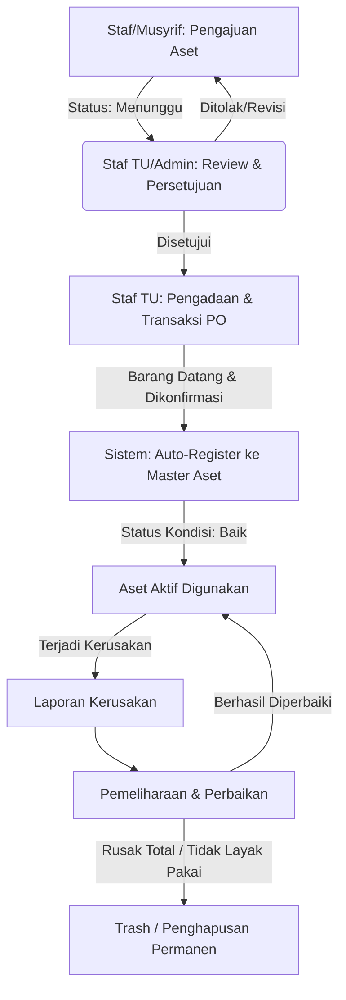
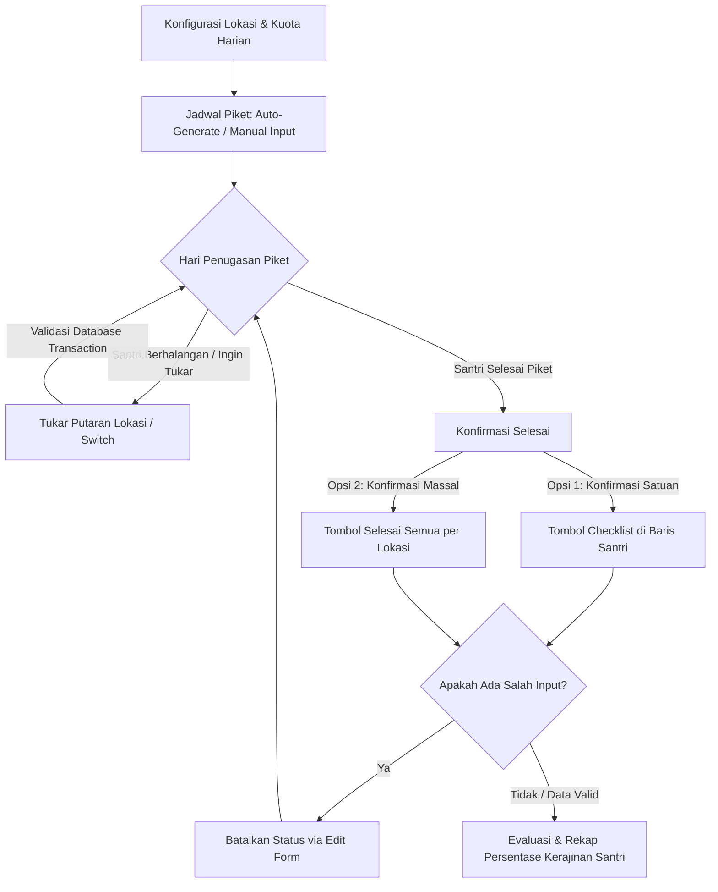
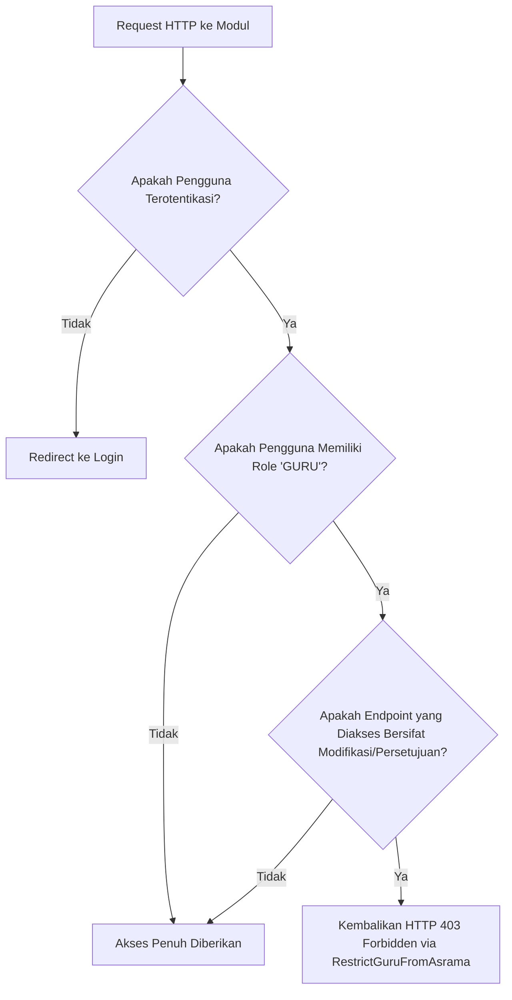

# 🏢 Modul Manajemen Aset & Asrama (Almahir)

Modul **Manajemen Aset & Asrama** adalah sub-sistem modular yang terintegrasi di dalam aplikasi **Almahir**. Modul ini dirancang khusus untuk mengelola tata kelola aset/inventaris pesantren (mulai dari pengajuan hingga pemeliharaan) sekaligus manajemen hunian kamar asrama santri serta penugasan kebersihan (piket harian) secara sistematis dan aman.

---

## 📁 Struktur Direktori Modul

Modul ini dirancang menggunakan pendekatan **Modular Architecture** di Laravel, yang mengisolasi seluruh logika bisnis, visual, model data, dan rute di dalam direktori `app/Modules/ManajemenAsetDanAsrama/`:

```text
app/Modules/ManajemenAsetDanAsrama/
├── Controllers/       # Controller penanganan request HTTP & logis bisnis UI
├── Migrations/        # Definisi skema tabel basis data
├── Models/            # Model Eloquent ORM dengan relasi & soft-deletes
├── Routes/            # Definisi route/endpoints modul (web.php)
├── Services/          # Layanan logika kompleks (misal: Smart Picket Generator)
├── Traits/            # Helper reusable traits (HasSoftDeleteWithUser, HasAssetCode)
├── Views/             # Template antarmuka pengguna berbasis Blade & AdminLTE 3
└── menu.php           # Konfigurasi navigasi sidebar modul
```

---

## 🚀 Fitur Utama & Fungsionalitas UI

### 1. Dashboard Asrama (`DashboardController`)
*   **Fungsi UI**: Halaman utama (landing page modul) yang menampilkan metrik-metrik ringkasan eksekutif secara dinamis:
    *   **Metrik Kamar & Penghuni**: Kapasitas total hunian versus jumlah slot terisi.
    *   **Metrik Piket Hari Ini**: Perbandingan jumlah santri yang telah menyelesaikan piket (`selesai`) dan yang belum (`belum`).
    *   **Status Pengajuan Aset**: Jumlah pengajuan pengadaan barang berstatus *Menunggu*, *Disetujui*, atau *Ditolak*.
*   **Keunggulan UX**: Desain grid box responsif yang menggunakan skema warna AdminLTE 3 dengan penyesuaian visual modern untuk memberikan impresi premium pada saat pertama kali dimuat.

### 2. Manajemen Siklus Hidup Aset (Asset Lifecycle)
*   **Pengajuan Aset (`PengajuanController`)**:
    *   **Fungsi UI**: Memungkinkan Musyrif atau Staf Asrama mengajukan pengadaan sarana/prasarana baru melalui formulir terstandardisasi.
    *   **Fitur**: Input nama barang, kategori, kuantitas, estimasi harga satuan, keterangan urgensi (Rendah/Sedang/Tinggi), deskripsi, dan tombol cetak tanda bukti.
*   **Persetujuan Aset (`PersetujuanController`)**:
    *   **Fungsi UI**: Panel khusus Admin/Staf TU untuk meninjau, menyetujui (`approve`), atau menolak (`reject`) pengajuan dari staf.
    *   **Fitur**: Tombol aksi konfirmasi instan yang dilengkapi dengan SweetAlert2 guna mencegah kesalahan persetujuan tak sengaja.
*   **Pengadaan Aset (`PengadaanController`)**:
    *   **Fungsi UI**: Pemrosesan pengajuan yang telah disetujui ke tahap transaksi pembelian.
    *   **Fitur**: Pencatatan nomor Purchase Order (PO), harga beli riil, nama toko, tanggal pemesanan, dan konfirmasi barang tiba.
    *   **Otomatisasi**: Ketika status pengadaan diubah menjadi **Barang Diterima**, sistem akan secara otomatis mendaftarkan barang tersebut ke dalam tabel **Master Aset** sesuai jumlah kuantitas pengadaan.
*   **Master Aset (`AsetController`)**:
    *   **Fungsi UI**: Katalog inventaris pusat pesantren yang mencatat semua aset aktif.
    *   **Fitur Utama**:
        *   **Smart Code Generator**: Penomoran kode unik otomatis berbasis pola, seperti `AST-YYYY-XXXX` (misal: `AST-2026-0001`).
        *   **Cetak Label QR**: Menghasilkan label QR Code untuk pelabelan fisik aset yang dapat dicetak secara massal.
        *   **Scan QR Aset**: Memungkinkan pencarian cepat detail spesifikasi aset hanya dengan memindai kode QR fisik via kamera browser.
        *   **Duplikasi Instan**: Memperbanyak entri aset sejenis dalam satu tindakan cepat dengan kode seri yang berurutan otomatis.
        *   **Bulk Destroy**: Penghapusan massal aset berdasarkan pola kode aset untuk efisiensi pembersihan data.
*   **Pelaporan Kerusakan (`KerusakanController`)**:
    *   **Fungsi UI**: Panel pelaporan sarana prasarana yang mengalami kerusakan di lingkungan pesantren.
    *   **Fitur**: Pencarian aset terintegrasi (Autocomplete via Select2), tingkat keparahan (Rusak Ringan / Rusak Berat), kronologi kerusakan, serta pengunggahan foto bukti fisik kerusakan.
*   **Pemeliharaan & Perbaikan (`PemeliharaanController`)**:
    *   **Fungsi UI**: Pengelolaan jadwal reparasi aset pasca pelaporan kerusakan.
    *   **Fitur**: Penugasan teknisi (internal/eksternal), rincian estimasi biaya perbaikan, serta opsi penyelesaian status pemeliharaan (kembali menjadi kondisi 'Baik' atau status 'Dihapuskan' jika aset sudah tidak layak pakai).

### 3. Manajemen Hunian & Asrama (Boarding Management)
*   **Data Kamar (`KamarController`)**:
    *   **Fungsi UI**: Pengelolaan data fisik kamar asrama pesantren (nama kamar, kapasitas maksimal, dan ketersediaan slot).
    *   **Validasi Aman**: Sistem mendeteksi kapasitas kamar dan menolak penurunan kapasitas apabila jumlah santri aktif yang menghuni kamar tersebut melebihi kapasitas baru yang diusulkan.
*   **Penghuni Kamar (`PenghuniController`)**:
    *   **Fungsi UI**: Menangani relasi penempatan santri ke dalam kamar asrama.
    *   **Fitur Unggulan**:
        *   **Assign Massal (Multiple Placement)**: Mempermudah penempatan kelompok santri ke kamar terpilih sekaligus dalam satu halaman tanpa perlu melakukan input satu per satu.
        *   **Smart Filter**: Hanya menampilkan santri aktif yang belum mendapatkan kamar asrama guna menghindari duplikasi penempatan.
*   **Jadwal Piket Asrama (`JadwalPiketController`)**:
    *   **Fungsi UI**: Manajemen jadwal kebersihan berkala untuk melatih kemandirian santri.
    *   **Fitur Unggulan**:
        *   **Auto-Generate Piket (Smart Generator)**: Algoritma cerdas yang membagi penugasan santri ke berbagai lokasi piket dan shift secara merata berdasarkan kuota per hari yang telah didefinisikan.
        *   **Tukar Putaran Lokasi (Switch Location)**: Pertukaran tempat piket secara instan antar santri pada hari dan shift yang sama dengan validasi transaksi database agar tidak memicu duplikasi data siswa.
        *   **Konfirmasi Massal "Selesai Semua"**: Tombol berdesain pill soft-green (`.btn-soft-success-header`) di pojok kanan atas header card lokasi piket pada halaman index. Fitur ini memungkinkan Musyrif mengonfirmasi penyelesaian piket seluruh santri di lokasi tersebut dalam satu klik (dilengkapi dialog konfirmasi).
        *   **Pembatalan Status Piket**: Opsi pembatalan status ("Batal Sudah Piket") yang diletakkan di dalam halaman edit penugasan piket menggunakan formulir terpisah demi menghindari isu *nested forms* di HTML.

### 4. Evaluasi & Analisis Piket (`JadwalPiketController@evaluasi`)
*   **Tab Evaluasi Harian**:
    *   **Fungsi UI**: Menyajikan evaluasi retrospectif harian dengan sistem navigasi halaman tanggal tunggal (hanya menampilkan 1 tanggal per halaman untuk meminimalkan beban scroll). Musyrif dapat memeriksa kepatuhan piket harian dan mengubah status piket santri secara langsung.
*   **Tab Rekap Kerajinan**:
    *   **Fungsi UI**: Menampilkan rangkuman persentase tingkat kepatuhan piket santri dalam rentang waktu tertentu.
    *   **Fitur**: Filter prediktif tingkat kerajinan santri:
        *   *Sangat Rajin* (Tingkat penyelesaian $\ge 80\%$)
        *   *Cukup Rajin* (Tingkat penyelesaian $50\% - 79\%$)
        *   *Kurang Rajin* (Tingkat penyelesaian $< 50\%$)
        *   *Belum Ada Jadwal* (Jumlah piket = 0)

### 5. Trash / Recycle Bin (`TrashController`)
*   **Fungsi UI**: Panel penampungan sementara data yang dihapus (mencegah kehilangan data permanen akibat kelalaian operasional).
*   **Fitur**: Mendukung pemulihan data (*Restore*) atau penghapusan permanen (*Force Delete*) untuk model data **Aset, Kamar, Kerusakan, Pemeliharaan, Pengajuan Aset, dan Pengadaan Aset**.

---

## 🔄 Alur Kerja Sistem (Workflows)

### 📊 1. Alur Siklus Hidup Aset (Asset Lifecycle Workflow)
Siklus pengadaan hingga penghapusan aset digambarkan dalam diagram berikut:



### 🧹 2. Alur Manajemen Piket Santri (Picket Management Workflow)
Alur penjadwalan, penugasan, pertukaran, konfirmasi selesai, hingga rekapitulasi performa santri:



### 🔒 3. Alur Otorisasi Akses (Authorization Workflow)
Alur pengecekan otorisasi yang dilewati oleh setiap request yang menuju ke modul Aset & Asrama:



---

## 🛠️ Arsitektur & Teknologi yang Digunakan

### 1. Backend Core & Database
*   **Bahasa Pemrograman**: PHP 8.x
*   **Framework**: Laravel (Model-View-Controller) dengan isolasi modul yang bersih.
*   **Database ORM**: Eloquent ORM untuk pemetaan objek database secara aman. Melindungi aplikasi dari celah **SQL Injection** dengan memanfaatkan teknik *Prepared Statements*.
*   **Database Transactions**: Menggunakan `DB::beginTransaction()` dan `DB::commit()` pada proses-proses krusial (seperti proses pertukaran lokasi piket atau pendaftaran pengadaan barang) untuk memastikan integritas data terjamin sepenuhnya (ACID Compliance).

### 2. Frontend & Template Rendering
*   **Blade Templating Engine**: Menyusun kerangka HTML dinamis di sisi server. Engine ini secara otomatis melakukan *output escaping* (`{{ }}`) untuk mencegah celah keamanan **Cross-Site Scripting (XSS)**.
*   **UI Framework**: Bootstrap 4 terintegrasi dengan template dashboard **AdminLTE 3**.
*   **Desain Aksen Premium (Custom CSS)**:
    *   **Shadows**: Penerapan efek bayangan halus (*soft shadows*) pada card panel untuk memberikan visual kedalaman yang menarik.
    *   **Soft Color Badges**: Penggunaan warna-warna soft berbasis HSL/RGBA untuk badge status guna menghindari warna-warna bawaan yang terlalu mencolok dan kurang estetik.
    *   **Micro-Animations**: Penerapan animasi interaksi hover (misal: `transform: translateY(-1px)` disertai transisi halus) pada tombol aksi krusial seperti tombol bulk confirmation "Selesai Semua".
    *   **Animate.css**: Pustaka animasi CSS untuk memicu efek masuk visual pada card statistik (`animate__fadeInUp`).

### 3. JavaScript & Library Pendukung
*   **jQuery**: Pustaka utama untuk manipulasi DOM, penanganan event, dan interaksi AJAX di sisi klien.
*   **Select2**: Dipakai untuk menyulap dropdown standar menjadi kolom pencarian teks dinamis (Autocomplete) untuk menangani ribuan data santri, kamar, dan aset dengan respons cepat.
*   **SweetAlert2 / Bootstrap Modals**: Digunakan untuk menampilkan pesan sukses/gagal, kotak dialog konfirmasi, dan modal input data tanpa menghalangi kelancaran antarmuka pengguna (non-blocking).
*   **Carbon**: Pustaka PHP untuk memanipulasi tanggal, perhitungan rentang waktu evaluasi, dan lokalisasi hari/bulan ke Bahasa Indonesia.

### 4. Sistem Keamanan & Proteksi
*   **CSRF Protection**: Penerapan token `@csrf` di setiap form dan header request AJAX untuk mencegah serangan pemalsuan permintaan lintas situs (Cross-Site Request Forgery).
*   **Role-Based Access Control (RBAC)**: Otorisasi hak akses berjenjang berbasis peran pengguna (`SUPER_ADMIN`, `STAF_TU`, `GURU`, `SISWA`).
*   **Middleware `RestrictGuruFromAsrama`**: Middleware khusus yang membatasi hak akses role `GURU` agar tidak dapat melakukan modifikasi data krusial asrama (seperti memproses persetujuan aset, membuat/mengedit kamar, melakukan penempatan santri, me-reset piket, atau mengakses trash) namun tetap diizinkan untuk melihat jadwal, mencetak label, dan memantau status piket.
*   **Laravel Soft Deletes**: Menggunakan trait `SoftDeletes` pada model-model data inventaris dan asrama agar data yang terhapus secara tidak sengaja dapat dipulihkan dengan mudah melalui menu Trash.

---

## 🗄️ Skema Database & Relasi Tabel

Modul ini berjalan di atas tabel-tabel berikut yang saling berelasi:

| Nama Tabel | Deskripsi Data | Hubungan / Relasi (Foreign Keys) | Sifat Penghapusan |
| :--- | :--- | :--- | :--- |
| **`kamar`** | Informasi kamar asrama pesantren | - | `SoftDeletes` |
| **`kamar_penghuni`** | Pencatatan santri yang menempati kamar | `kamar_id` (ke tabel `kamar`), `siswa_id` (ke tabel `siswa`) | Hard Delete / Aktif flag |
| **`aset`** | Katalog aset/inventaris aktif | `kamar_id` (opsional, ke tabel `kamar`), `pengadaan_id` (opsional, ke tabel `pengadaan_aset`) | `SoftDeletes` |
| **`pengajuan_aset`**| Data usulan pengadaan barang baru | `user_id` (pembuat pengajuan) | `SoftDeletes` |
| **`pengadaan_aset`**| Pencatatan transaksi realisasi aset | `pengajuan_id` (ke tabel `pengajuan_aset`) | `SoftDeletes` |
| **`kerusakan`** | Laporan kerusakan aset fisik | `aset_id` (ke tabel `aset`), `user_id` (pelapor) | `SoftDeletes` |
| **`pemeliharaan`** | Catatan servis dan perbaikan aset | `aset_id` (ke tabel `aset`), `kerusakan_id` (opsional, ke tabel `kerusakan`) | `SoftDeletes` |
| **`jadwal_piket`** | Penugasan piket kebersihan harian | `siswa_id` (ke tabel `siswa`), `kamar_id` (ke tabel `kamar`) | Hard Delete (Bisa di-reset) |

---
*Dokumentasi ini dibuat untuk mempermudah pemahaman tata kelola alur kerja sistem serta pemeliharaan kode program Modul Manajemen Aset & Asrama di aplikasi **Almahir**.*
